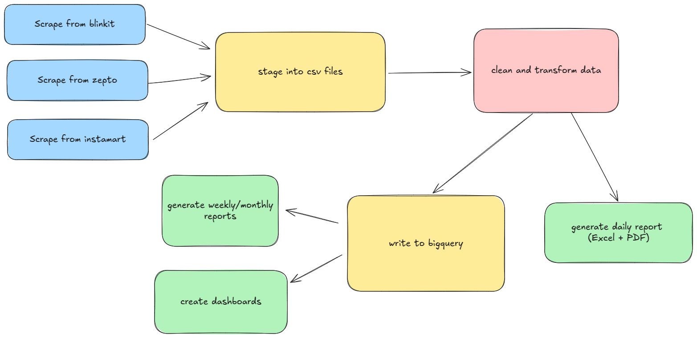

# Automated Ecommerce Reporting

## 📖 Table of Contents  

1. [Overview](#overview)  
2. [Installation & Setup](#installation--setup)  
   - [Clone the Repository](#clone-the-repository)  
   - [Install Dependencies](#install-dependencies)  
   - [Configure Environment Variables](#configure-environment-variables)  
   - [Set Up Google BigQuery](#set-up-google-bigquery)  
3. [Data Flow Architecture](#data-flow-architecture)  
4. [Usage](#usage)  
   - [Running the Scraper](#running-the-scraper)  
   - [Loading Data into BigQuery](#loading-data-into-bigquery)  
   - [Generating Reports](#generating-reports)  
5. [Automation & Scheduling](#automation--scheduling)  
6. [Dockerizing & Running in Google Cloud Run](#dockerizing--running-in-google-cloud-run)  
   - [Building a Docker Image](#building-a-docker-image)  
   - [Deploying to Google Cloud Run](#deploying-to-google-cloud-run)  
   - [Environment Variables & Secrets](#environment-variables--secrets)  
7. [Project Structure](#project-structure)  
8. [License](#license)  
9. [Future Enhancements](#future-enhancements)  
10. [Need Help?](#need-help)  
11. [Disclaimer](#disclaimer)

---

## Overview
The purpose of the project is to scrape listings data from indian quick commerce stores for analytics purposes. 
These include: 
1. Competitive Price Monitoring 
2. Market Research & Trend Analysis
3. Ads and Promotion Tracking  

## Installation & Setup

Ensure you have the following requirements for installation and setup:
1. [Install git](https://git-scm.com/book/en/v2/Getting-Started-Installing-Git)
2. [Install uv](https://docs.astral.sh/uv/getting-started/installation/)

### Clone the Repository

```commandline
git clone https://github.com/avasireddi3/automated_ecommerce_reporting.git
```

### Install Dependencies

```commandline
uv sync --frozen
```

### Configure Environment Variables
You can setup the secrets required by following the steps below:  

1. Create a secrets.env file
```
touch secrets.env
```
2. Add the following environment variable
```
#Gmail details for sending automated mail
GMAIL_ADDRESS=
GMAIL_PASSWORD=

#Gmaps key for reverse geocoding store locations
GMAPS_API_KEY=

#Path to credentials for google bigquery service account key
GOOGLE_APPLICATION_CREDENTIALS=
```

Please note the following:

- The `GMAIL_PASSWORD` is an [app password](https://support.google.com/accounts/answer/185833?hl=en)
- You can setup a `GMAPS_API_KEY` [here](https://developers.google.com/maps/documentation/geocoding/get-api-key), the first 70,000 requests or so are free
- You only need `GOOGLE_APPLICATION_CREDENTIALS` if you plan on using this code with a bigquery instance

### Set Up Google BigQuery

## Data Flow Architecture



## Usage

### Running the Scraper

### Loading Data into BigQuery

### Generating Reports

## Automation & Scheduling

## Dockerizing & Running in Google Cloud Run

### Building a Docker Image

### Deploying to Google Cloud Run

### Environment Variables & Secrets

## Project Structure

```.
ecommerce-listing-analytics
├── src     
│   ├── config.py > configuration settings
│   ├── etl > extract,transform,load     
│   │   ├── ecomScrapers > scraper specific code
│   │   │   ├── blinkit_scraper.py > scraper for blinkit
│   │   │   ├── instamart_scraper.py > scraper for instamart
│   │   │   └── zepto_scraper.py > scraper for zepto
│   │   ├── extract.py > run scrapers over locations and queries
│   │   ├── load_data.py > load data into database,staging files
│   │   └── transform.py > clean and transform data
│   ├── __main__.py > workflow of entire process
│   ├── reportGeneration > automate reporting
│   │   ├── report_generator.py > generate pdf
│   │   └── send_email.py > send email
│   ├── storeLocators
│   │   ├── blinkit_locator.py > find blinkit stores
│   │   ├── find_locality.py > reverse geocode area
│   │   ├── instamart_locator.py > find instamart stores
│   │   ├── store_locator.py > run locator across latitude longitude range
│   │   └── zepto_locator.py > find zepto stores
│   └── utils
│       ├── constants.py > queries for listings
│       ├── data_models.py > models for listings and store locations
│       ├── helper_functions.py > various helper functions
├── assets > to use in report generation
├── build_docker
│   └── Dockerfile > docker file to build and run code
├── pyproject.toml
├── README.md
└── uv.lock
```


## License

## Future Enhancements

## Need Help?


## Disclaimer
This project is intended for educational purposes only. The code and examples provided here demonstrate web scraping techniques solely to help others learn and understand how web data can be accessed and processed.

**Respect for Websites and Their Terms of Service**:
Please be mindful of the terms of service and robots.txt policies of any website you interact with using this code. Unauthorized or excessive scraping can violate legal and ethical guidelines.

**No Warranty or Liability**:
This project is provided "as is" without any warranties or guarantees. The authors assume no responsibility for any misuse, damage, or legal issues that may arise from the use of this code.

**Use Responsibly**:
If you plan to use this code beyond educational exploration, ensure you have permission from website owners and comply with all relevant laws and guidelines.

By using this project, you agree to use it responsibly and for learning purposes only.